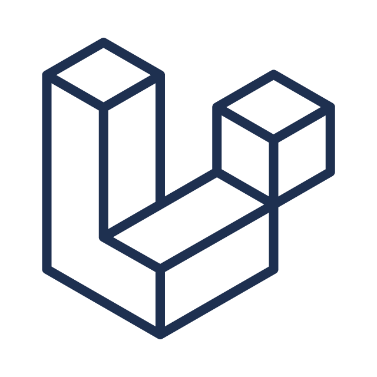

  

    
    

      

        
        
        
      

      
marwin@developer:~

    

    

      marwin-mandocdoc ~ $ cat introduction.md 
      &gt; Aspiring Software Developer, Project Manager, &amp; Cybersecurity Enthusiast. 
      
      marwin-mandocdoc ~ $ ./get_status.sh 
      [✓] Coding skills loaded successfully. 
      [✓] Open for collaborations. 
      
      marwin-mandocdoc ~ $ ▒
    

  

  <h3>🛠️ Languages and Tools</h3>

<table align="center" width="80%">
  <tr>
    <td align="center" width="50%">
      <h4>💻 Programming Languages</h4>
      

         &nbsp;
         &nbsp;
         &nbsp;
        
      

    </td>
    <td align="center" width="50%">
      <h4>⚛️ Frameworks</h4>
      

         &nbsp;
         &nbsp;
         &nbsp;
         &nbsp;
        
      

    </td>
  </tr>
  <tr>
    <td align="center">
      <h4>🎨 Frontend Development</h4>
      

         &nbsp;
        
      

    </td>
    <td align="center">
      <h4>🗄️ Backend Development</h4>
      

         &nbsp;
        
      

    </td>
  </tr>
  <tr>
    <td align="center">
      <h4>🎮 Game Engines</h4>
      

        
      

    </td>
    <td align="center">
      <h4>🐧 Other Tools</h4>
      

         &nbsp;
        
      

    </td>
  </tr>
</table>

 

  <h3>📊 GitHub Analytics</h3>
  

    
    
  

   
  

    
  

