  <h1>Hi 👋, I'm Marwin Mandocdoc</h1>
  
<i>Aspiring Software Developer | Project Manager | Cybersecurity Enthusiast</i>

 

<!-- TERMINAL INTRODUCTION -->

  <table width="100%" style="max-width: 750px;">
    <tr bgcolor="#161b22">
      <td style="padding: 10px;">
        
      </td>
      <td align="right" style="padding: 10px; font-family: monospace; color: #8b949e; font-size: 13px;">
        marwin@developer:~ &nbsp;
      </td>
    </tr>
    <tr bgcolor="#0d1117">
      <td colspan="2" align="left" style="padding: 20px;">
        
      </td>
    </tr>
  </table>

 

<!-- TECH STACK GRID -->
<h3 align="center">🛠️ Tech Stack & Ecosystem</h3>

   
  <!-- Programming Languages -->
  
  
  
  
    
  <!-- Frameworks & Libraries -->
  
  
  
  
  
    
  <!-- Frontend & DBs -->
  
  
  
  
    
  <!-- DevOps & Tools -->
  
  
  

 
 

<!-- ANALYTICS SECTION -->
<h3 align="center">📊 GitHub Analytics & Activity</h3>

  <!-- Streak Stats Card -->
  

    
  

 
<!-- COLLAPSIBLE DYNAMIC METRICS SECTION -->

  

    
  <!-- Indepth Analysis -->
  

    
<b>▼ Indepth analysis (clone and analyze repositories)</b>

    

       
      
    

  

  

 

<!-- FOOTER / SOCIALS -->

  

  
<b>Let's build something great together.</b>

  

    
    
    <!-- Tandaan na palitan ang link sa ibaba kapag live na ang iyong portfolio website -->
    
  

